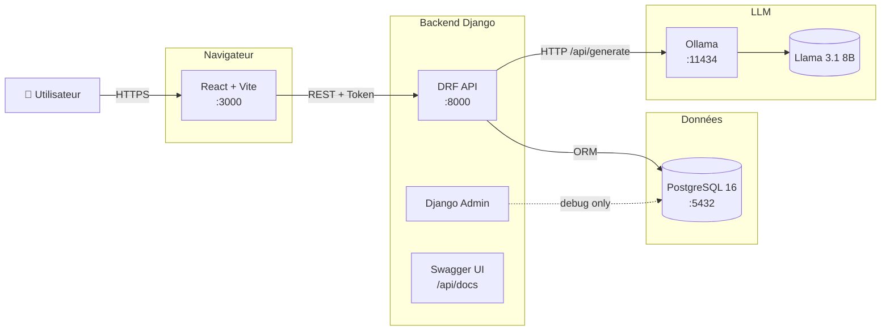
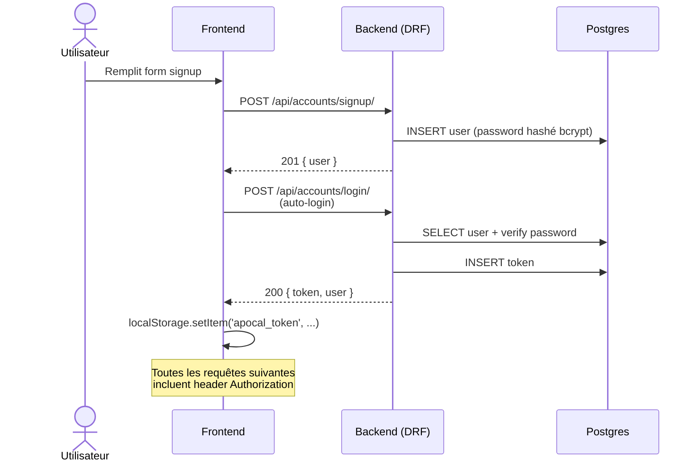
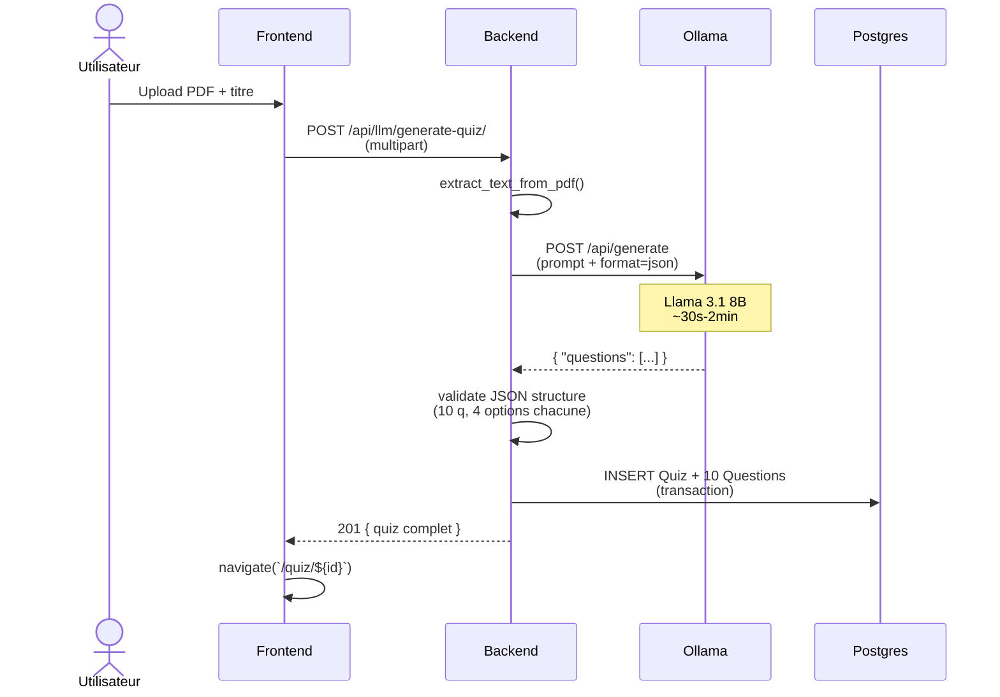

# 01 — Architecture

Vue d'ensemble du kit et flux principaux.

---

## 🗺️ Vue d'ensemble

---

## 📦 Composants

### Backend (Django + DRF)

| App | Responsabilité |
|---|---|
| `apocal/` | Projet Django (settings, urls, wsgi/asgi) |
| `accounts/` | Auth REST : signup, login, logout, me — token DRF + session |
| `llm/` | Intégration LLM : ping + génération de quiz, abstraction Ollama/Mock |
| `quizzes/` | Modèles métier : Quiz + Question, historique, correction |

**Choix techniques** :
- `IsAuthenticated` par défaut sur toute l'API (sauf signup/login)
- Token DRF persisté en localStorage côté front
- Session Django activée en parallèle (utile pour Swagger UI)
- `drf-spectacular` pour générer le schéma OpenAPI automatiquement

### Frontend (React + Vite + TS)

| Dossier | Contenu |
|---|---|
| `src/api/` | Clients axios par domaine (auth, llm, quizzes) |
| `src/contexts/AuthContext.tsx` | Provider + hook `useAuth()` |
| `src/components/` | `Layout`, `RequireAuth` |
| `src/pages/` | 5 pages (Home, Login, Signup, Upload, Quiz, History) |

**Choix techniques** :
- React Router 6 (data routers non utilisés pour rester simple)
- TypeScript strict (`noUnusedLocals`, `noUncheckedIndexedAccess`)
- Tailwind CSS avec palette alignée site (indigo + ambre)
- Axios avec interceptors token + 401 handling

### Infrastructure

| Service | Image | Volume | Port |
|---|---|---|---|
| `postgres` | postgres:16-alpine | postgres-data | 5432 |
| `ollama` | ollama/ollama:latest | ollama-data | 11434 |
| `backend` | local (Dockerfile) | `./backend:/app` | 8000 |
| `frontend` | local (Dockerfile) | `./frontend:/app` + node_modules séparé | 3000 |

---

## 🔐 Flux d'authentification

---

## 🤖 Flux de génération de quiz

---

## 🎯 Périmètre 30 % MVP

Ce qui est **déjà câblé** dans le kit :

- ✅ Auth complète (signup/login/logout/me)
- ✅ Modèles Quiz + Question + migrations
- ✅ Endpoint génération LLM avec mock + Ollama
- ✅ Endpoint correction (score + détails)
- ✅ Endpoint historique paginé
- ✅ Frontend skeleton avec 5 pages fonctionnelles

Ce qui **reste à faire** pour la Release 1 (MVP must-have) :
- Polir le frontend (design, UX, transitions)
- Tester avec de vrais cours étudiants
- Améliorer le prompt LLM si la qualité des QCM est médiocre
- Ajouter validation supplémentaire (longueur prompts, etc.)
- Documenter votre code

Ce qui est **catalogue Release 2** (libre) :
- Questions ouvertes (LLM-graded)
- Dashboard de progression
- Identification des lacunes
- Plan de révision personnalisé
- Multi-cours, multi-difficulté, flashcards…

---

## 👉 Suite

- [02-llm-integration.md](./02-llm-integration.md) — Modifier l'intégration LLM
- [03-auth.md](./03-auth.md) — Auth REST en détail
