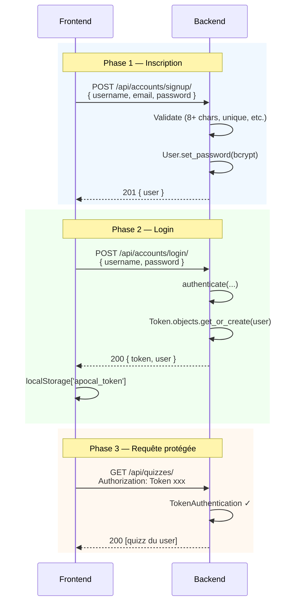

# 03 — Authentification

Comment fonctionne l'auth REST du kit, et où ajouter de la logique métier.

---

## 🎯 Choix architectural

| Choix | Pourquoi |
|---|---|
| **Token DRF** | Stateless côté serveur, parfait pour un front React |
| **+ Session Django activée** | Permet l'utilisation de Swagger UI (auth via login) |
| Pas de **JWT** dans le kit | Surdimensionné, pas de besoin de federation/expiry court |
| **bcrypt** (Django par défaut) | Standard sécurité, validation `password_validators` activée |
| Pas de **CORS** ouvert | Whitelist explicite `localhost:3000` (Vite dev) |

---

## 🔄 Flux signup → login → action protégée



---

## 🛠️ Endpoints disponibles

| Méthode | URL | Permission | Description |
|---|---|---|---|
| POST | `/api/accounts/signup/` | AllowAny | Crée un compte |
| POST | `/api/accounts/login/` | AllowAny | Renvoie `{ token, user }` |
| POST | `/api/accounts/logout/` | IsAuthenticated | Invalide le token + détruit session |
| GET | `/api/accounts/me/` | IsAuthenticated | Renvoie l'utilisateur courant |

---

## 🏗️ Étendre — exemple : ajouter "mot de passe oublié"

### 1. Vue dans `accounts/views.py`

```python
from rest_framework.permissions import AllowAny
from django.contrib.auth.tokens import default_token_generator
from django.utils.http import urlsafe_base64_encode
from django.utils.encoding import force_bytes


class ForgotPasswordView(APIView):
    permission_classes = [AllowAny]

    def post(self, request):
        email = request.data.get("email")
        try:
            user = User.objects.get(email=email)
        except User.DoesNotExist:
            return Response(status=204)  # ne pas leak l'existence

        token = default_token_generator.make_token(user)
        uid = urlsafe_base64_encode(force_bytes(user.pk))
        # TODO : envoyer un email avec un lien /reset/{uid}/{token}/
        return Response(status=204)
```

### 2. URL dans `accounts/urls.py`

```python
path("forgot-password/", ForgotPasswordView.as_view(), name="forgot-password"),
```

### 3. Test dans `accounts/tests.py`

```python
def test_forgot_password_with_unknown_email_returns_204(client):
    response = client.post("/api/accounts/forgot-password/",
                           {"email": "ghost@nowhere.com"}, format="json")
    assert response.status_code == 204
```

---

## 🚨 Sécurité — checklist

### ✅ Bonnes pratiques déjà appliquées

- bcrypt pour les passwords
- Validators Django activés (min 8 chars, common password)
- Token DRF (rotaté à chaque login)
- `IsAuthenticated` par défaut sur les vues métier
- Filtrage par user dans les querysets (`Quiz.objects.filter(user=request.user)`)
- CORS whitelist explicite
- Pas de SECRET_KEY hardcoded (lue depuis `.env` via `python-decouple`)

### ⚠️ À renforcer en production

- [ ] Forcer HTTPS (cf docs/05-ci-cd.md pour le déploiement)
- [ ] Activer rate limiting sur `/login/` (anti-bruteforce)
- [ ] Ajouter `django-axes` ou équivalent (lockout après N tentatives)
- [ ] Configurer `SESSION_COOKIE_SECURE = True` et `CSRF_COOKIE_SECURE = True`
- [ ] Tokens DRF avec expiration (par défaut ils sont infinis !) — voir `djangorestframework-simplejwt` si besoin

### ❌ Anti-pattern à éviter

```python
# ❌ NE FAITES PAS ÇA
return Response({"detail": f"Aucun utilisateur avec {email}"}, status=404)
# → leak de l'existence des comptes

# ✅ FAITES ÇA
return Response(status=204)  # même réponse, qu'il existe ou pas
```

---

## 👉 Suite

- [04-testing.md](./04-testing.md) — Tester les endpoints d'auth
- [07-bonnes-pratiques.md](./07-bonnes-pratiques.md) — DoR / DoD pour sécurité
